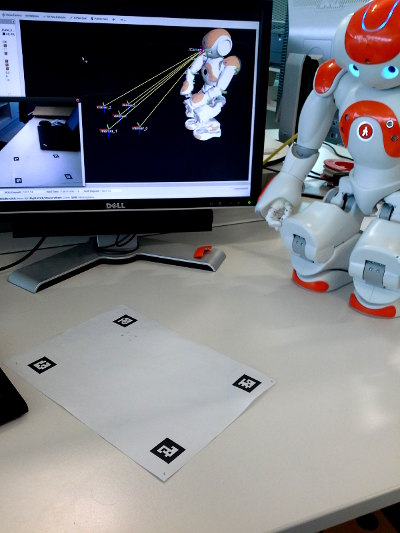

ros_markers
===========

This project is a ROS wrapper for the EPFL's chilitags library.



The [chilitags](http://chili.epfl.ch/software) C++ library is a robust
and lightweight library for detection of fiducial markers.

Main features:
- recognizes up to 1024 markers simultaneously in a scene, 
- has a focus on robustness to bad light conditions, 
- provides (filtered) 6D localization of the markers,
- supports objects with multiple markers (with increased robustness),
- OpenCV (>=2.3) is the only dependency.

This ROS node wraps the chilitags library to use the standard ROS mechanisms:
images and camera calibration are read from a standard ROS camera, and 6D
position of markers are published as TF transforms.

An example usage is:

```
$ roslaunch ros_markers detect image_topic:=v4l/camera/image_raw camera_frame_id:=v4l_frame
```

This will start to look for markers in the image stream, and publish the TF
transformation of the detected ones.

The provided [launch file](launch/detect.launch) lists all of the available
parameters. The most important one is the *markers configuration*.  This (YAML)
file describes where the markers are on your objects, and lets you publish the
position of an object with multiple markers attached. See [the sample
configuration](config/markers_configuration_sample.yml) for a complete example.

Other resources
---------------

- This project is very similar to [ROS
ALVAR](http://wiki.ros.org/ar_track_alvar). ALVAR has a broader scope (like
support for integration with depth maps), but it is also heavier. Benchmarks
have yet to be conducted.
- The standard (but much older) tool is ARToolkit. It also has [ROS
  bindings](http://wiki.ros.org/artoolkit).

